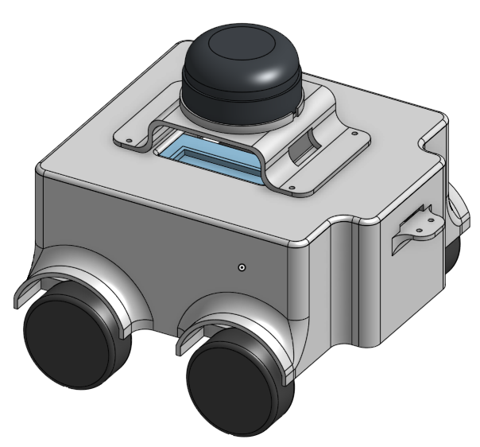

This is a mini 4wd AMR, used for mapping and localization, as well as navigation in a medium range area.

This mobile vehicle used ROS2, slam-toolbox and nav2 to move, rviz2 to visualize.

This is the design of the robot

This is our design file onshape:

[Puppet Design](https://cad.onshape.com/documents/1da5719744e1f87aab21f472/w/5079e67a0fb3568f5565d542/e/40b7dfcc1ac2638a488470c8)

